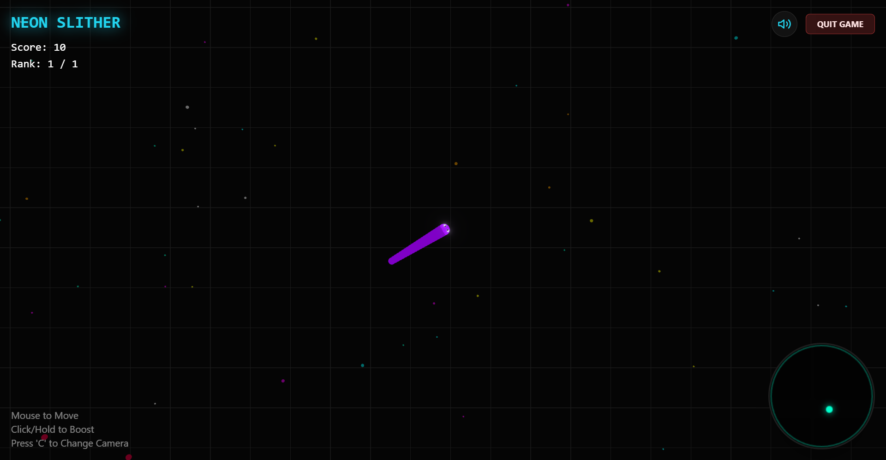
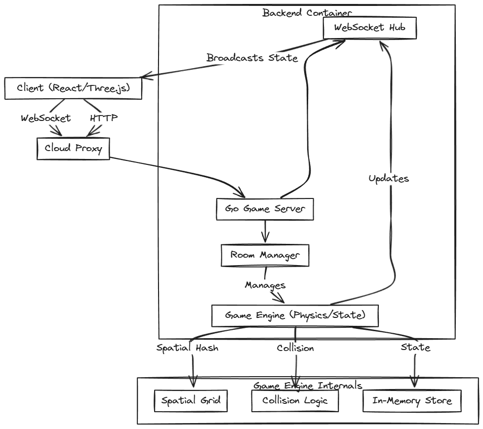

# Neon Slither - High Performance Multiplayer Snake Game

A modern, high-performance real-time multiplayer snake game built with **Golang**, **WebSockets**, and **React Three Fiber**. Designed for low latency, smooth gameplay, and easy deployment as a monolithic Docker container.



## Key Features

*   **Real-time Multiplayer**: Powered by Go WebSockets (`gorilla/websocket`) for sub-millisecond latency.
*   **Spatial Hashing**: Efficient collision detection and food distribution using a spatial hash grid.
*   **Area of Interest (AOI)**: Optimized network bandwidth by only sending visible entities to clients.
*   **Smooth Interpolation**: Client-side linear interpolation for butter-smooth snake movement even with network jitter.
*   **Modern Graphics**: 3D rendering with **Three.js** and **React Three Fiber**, featuring neon bloom effects and dynamic camera.
*   **Production Ready**: Dockerized monolithic architecture for easy deployment on free-tier platforms (Koyeb, Render).

## 🛠️ Technology Stack

### Backend
*   **Language**: Go (Golang) 1.24
*   **Architecture**: Authoritative Server
*   **Communication**: WebSocket (Real-time state), REST API (Room management)
*   **Optimization**: Static Linking (`CGO_ENABLED=0`), In-Memory State.

### Frontend
*   **Framework**: React 18 + Vite
*   **Graphics**: React Three Fiber (Three.js)
*   **State Management**: In-memory Game Engine Class
*   **Styling**: TailwindCSS

### DevOps
*   **Container**: Docker (Multi-stage build, Alpine Linux)
*   **Orchestration**: Docker Compose
*   **CI/CD**: Compatible with any Git-based deployment.

---

## System Architecture

The system follows a centralized authoritative server model to prevent cheating and ensure consistency.



## Getting Started

### Prerequisites
*   [Docker Desktop](https://www.docker.com/products/docker-desktop/) installed and running.
*   Node.js (optional, for local frontend dev without Docker).

### Run Locally (Recommended)

1.  **Clone the repository**
    ```bash
    git clone https://github.com/kyyril/slither.git
    cd slither
    ```

2.  **Start with Docker Compose**
    This will spin up the Backend (Go) and Redis (Optional) and expose the game.
    *Note: The Frontend is currently part of the repo but typically run separately or served by the backend in a full monolith setup. For dev, we run frontend separately.*

    ```bash
    docker compose up -d --build
    ```
    *   Backend API: http://localhost:8080
    *   Backend WebSocket: ws://localhost:8080

3.  **Run Frontend (Development)**
    ```bash
    npm install
    npm run dev
    ```
    Open http://localhost:3000 to play!

---

## Deployment

The project is configured with a root `Dockerfile` for seamless deployment on platforms like **Koyeb**, **Render**, or **Railway**.

### Steps for Koyeb/Render:
1.  Push your code to a GitHub repository.
2.  Create a new "Web Service".
3.  Connect your repository.
4.  **Builder**: Docker
5.  **Environment Variables**:
    *   `PORT`: `8080`
    *   `ALLOWED_ORIGINS`: `*` (or your frontend domain)
    *   `REDIS_URL`: (Optional)

### Environment Variables
| Variable | Description | Default |
| :--- | :--- | :--- |
| `PORT` | Server listening port | `8080` |
| `ALLOWED_ORIGINS` | CORS Allowed Origins | `*` |
| `REDIS_URL` | Redis connection string (Future use) | `redis://redis:6379` |

---

## Project Structure

```
├── server/             # Go Backend Source
│   ├── engine/         # Physics & Game Logic (Spatial Hash, Snake)
│   ├── manager/        # Room Management
│   ├── models/         # Shared Data Structures
│   ├── network/        # WebSocket Hub & Broadcasting
│   └── main.go         # Entry Point
├── src/                # React Frontend Source
│   ├── components/     # UI & 3D Components (Three.js)
│   ├── game/           # Client-side Game Engine & Interpolation
│   └── App.tsx         # Main Component
├── Dockerfile          # Multi-stage production build
├── docker-compose.yml  # Local development orchestration
└── README.md           # Documentation
```
